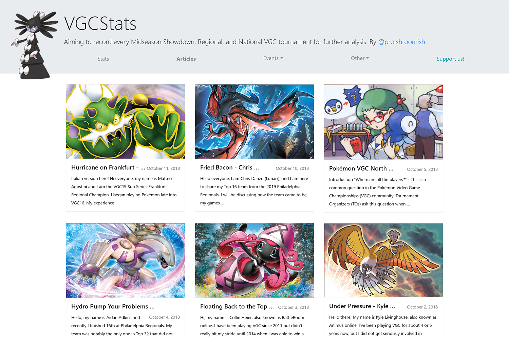

#  VGCStats Articles Theme

A Hugo theme for the VGCStats articles section, based on the [Hugo Cards](https://github.com/bul-ikana/hugo-cards) theme.

## What is different?

The main differences from the base Hugo Card theme are, of course, related to the layout. The header from the VGCStats was added, and overall colors were adjusted a bit. This theme also uses Bootstrap 4 instead of Bootstrap 3.
